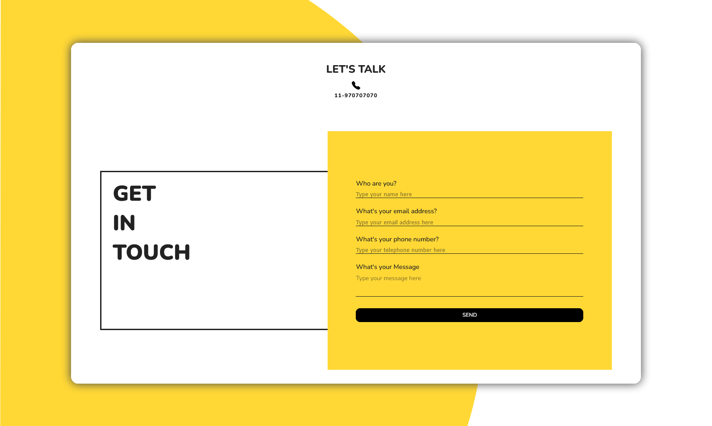

# contact form
A contact form page for desktop and laptop.

---

## 🚀 Technologies

This project was developed with the following technologies:

- HTML
- CSS
- [Custom font from Google Fonts](https://fonts.google.com/) 

---

## 📷 Screenshots

### Desktop


---

## 📦 How to use

1. Clone the repository:
```bash
git clone https://github.com/michaelprocha/alura-portfolio.git
```
2. Abra o arquivo `index.html` em qualquer navegador.

---

## 👨‍💻 Author

Made by [Michael Rocha](https://github.com/michaelprocha)

---

## 📄 License

This project is licensed under the MIT License. See the LICENSE file for more details.